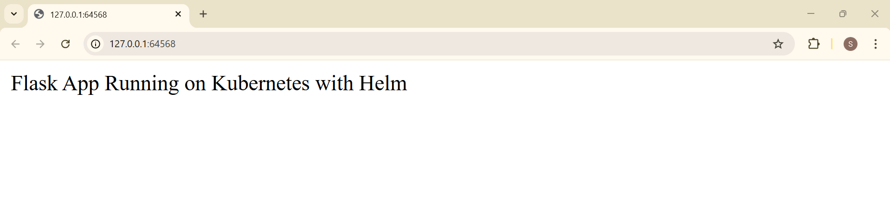
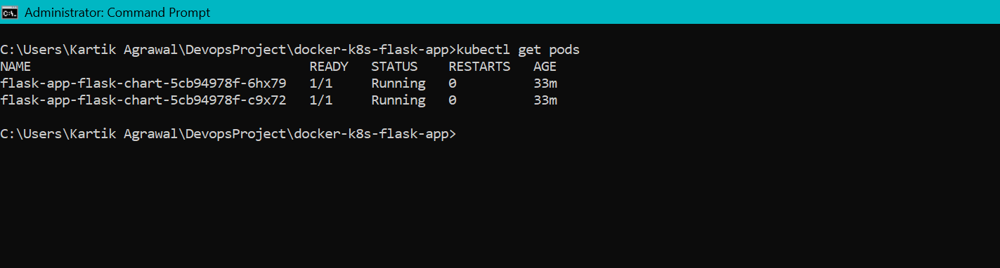
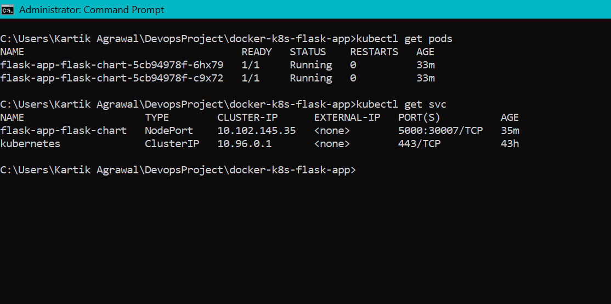
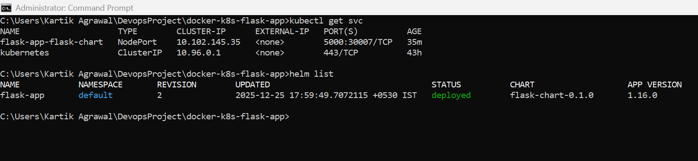

# Containerized Flask App on Kubernetes using Helm

## Project Overview
This project demonstrates containerization, orchestration, and deployment of a Flask application using Docker, Kubernetes, and Helm.

## Tech Stack
- Docker
- Kubernetes (Minikube)
- Helm
- Python (Flask)

## Architecture
- Docker image hosted on Docker Hub
- Kubernetes Deployment & Service
- Helm chart for release management

## Features
- Containerized application using Docker
- Kubernetes-based deployment and service exposure
- Horizontal scaling using replicas
- Rolling updates and rollbacks
- Helm-based release management

## Setup Instructions

### Build & Push Docker Image
```bash
docker build -t agrawalkartik136/my-flask-app:v1 .
docker push agrawalkartik136/my-flask-app:v1


## 📸 Screenshots

### Application Running on Kubernetes
[]screenshots\app-running.png

### Kubernetes Pods
[]screenshots\kubectl-get-pods.png

### Kubernetes Services
[]screenshots\kubectl-get-svc.png

### Helm Release
[]screenshots\helm-release.png
